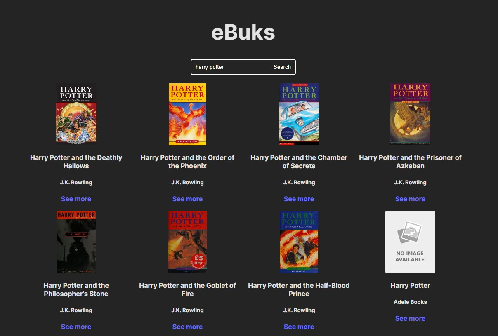

## Introduction

eBuks is a web app that allows users to search for books from the Open Library API. The app uses the Open Library API to fetch book information, including the title, author, cover image, and a link to the book's page on Open Library.

Here are some of the features of eBuks:

- Search for books by title, author, or ISBN
- View book information, including the title, author, cover image, and a link to the book's page on Open Library

